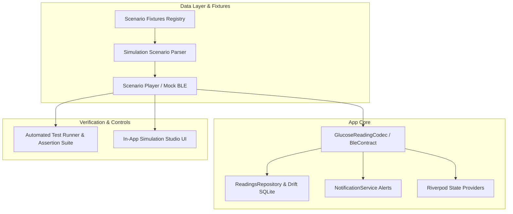

# App Simulation Test Implementation Plan

**Goal:** Complete end-to-end implementation of the BLE device-simulation test framework for the Glucose App, covering packet contract standardization, a rich scenario fixture library, in-process simulation engine, interactive in-app debug UI, and automated test runner.

---

## 1. Architecture Overview

---

## 2. Packet Contract & Schema (`BleContract`)

### 4-Byte Standard Payload (Backward Compatible)
- `byte 0`: Glucose Class (`0 = low`, `1 = normal`, `2 = high`)
- `byte 1`: Confidence (`0 - 100%`)
- `bytes 2..3`: mg/dL estimate, uint16 LE (tenths of mg/dL)

### 8-Byte Extended Payload (New Specification)
- `byte 0`: Glucose Class (`0 = low`, `1 = normal`, `2 = high`)
- `byte 1`: Confidence (`0 - 100%`)
- `bytes 2..3`: mg/dL estimate, uint16 LE (tenths of mg/dL)
- `byte 4`: Sensor-Health Flags (Bitmask: `0x01` = Motion Artifact, `0x02` = Poor Skin Contact, `0x04` = Low Battery, `0x08` = Sensor Fault)
- `byte 5`: Model Origin (`0x00` = On-Device, `0x01` = Phone-Side Background)
- `bytes 6..7`: Reserved / Packet Sequence Counter (uint16 LE)

---

## 3. Case Library (9 Data Fixtures across 6 Categories)

1. **Regular Use**:
   - `regular_use_normal_range`: Stable connection, 10 normal-range readings (90–120 mg/dL), normal battery, 0 alerts.
2. **Extreme / Clinical**:
   - `hypoglycemia_event`: Rapid descent into hypoglycemia (85 -> 65 -> 52 mg/dL), triggers low alert transition.
   - `hyperglycemia_event`: Steep rise (130 -> 195 -> 240 mg/dL), triggers high alert transition.
   - `rapid_swings`: Oscillating across low, normal, and high thresholds to verify edge-triggered alerts and debouncing.
3. **Confidence & Quality**:
   - `low_confidence_disagreement`: Low-confidence readings (<50%) and model disagreement flags.
   - `corrupted_missing_packets`: Malformed byte sequences and truncated payloads to verify zero crashes and graceful degradation.
4. **Connectivity**:
   - `disconnect_reconnect`: Mid-stream disconnect event, reconnection, and data stream recovery.
5. **Signal Integrity**:
   - `signal_integrity_flags`: Packets carrying motion artifact, poor skin contact, and low battery flags.
6. **Timing**:
   - `timing_burst_and_jitter`: High-frequency burst packets (0ms gap) and out-of-order timestamps.

---

## 4. In-Process Mock & Simulation Engine
- `ScenarioPlayer` implementing `BleManager`.
- Supports 3 execution modes:
  1. **Instant Mode**: Fast-forward execution for unit tests and headless automated runs.
  2. **Timed Mode**: Real-time or scaled (1x, 2x, 5x, 10x) playback for live in-app testing.
  3. **Step Mode**: Manual single-step event inspection.
- Streams live progress, event logs, active flags, and connection states.

---

## 5. In-App Interactive Simulation Studio
- Accessible from **Settings > Developer Options > BLE Simulation Studio**.
- Category filter, scenario selector cards, playback controls, live flag chips, real-time event logs, and a "Run All Scenarios" self-test suite.

---

## 6. Automated Test Suite
- `test/simulation/packet_contract_test.dart`: Codec, bitmasks, and malformed payload resilience.
- `test/simulation/scenario_suite_test.dart`: Complete headless runner executing all 9 scenario fixtures and verifying all assertions.
